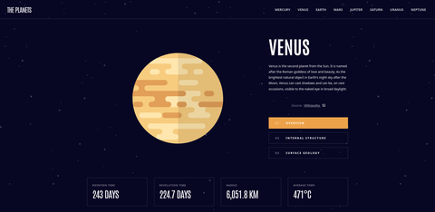
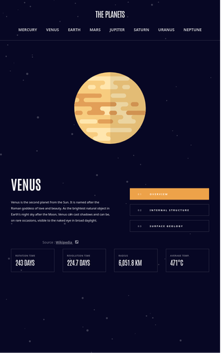
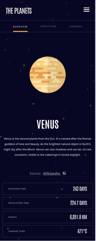

# Frontend Mentor - Planets fact site solution

This is a solution to the [Planets fact site challenge on Frontend Mentor](https://www.frontendmentor.io/challenges/planets-fact-site-gazqN8w_f). Frontend Mentor challenges help you improve your coding skills by building realistic projects.

## Table of contents

- [Overview](#overview)
  - [The challenge](#the-challenge)
  - [Screenshot](#screenshot)
  - [Links](#links)
- [My process](#my-process)
  - [Built with](#built-with)
  - [What I learned](#what-i-learned)
  - [Useful resources](#useful-resources)
- [Author](#author)
- [Acknowledgments](#acknowledgments)

## Overview

### The challenge

Users should be able to:

- View the optimal layout for the app depending on their device's screen size
- See hover states for all interactive elements on the page
- View each planet page and toggle between "Overview", "Internal Structure", and "Surface Geology"

### Screenshot

#### Desktop

#### Tablet

#### Mobile

### Links

- Solution URL: [GitHub Repo](https://github.com/bradleyhop/frontend-mentor-planet-facts-site)
- Live Site URL: [via GitHub Pages](https://bradleyhop.github.io/frontend-mentor-planet-facts-site/)

## My process

### Built with

- Semantic HTML5 markup
- CSS custom properties
- Flexbox
- CSS Grid
- Sass
- Mobile-first workflow
- [Vue 3](https://vuejs.org/) - JS library

### What I learned

At first, I was going to build a page for each planet and use Vue Router to link
the pages together. However, I quickly changed my strategy to abstraction and
instead use a component to display a planet's information. The main page pulls
in a local json file, sets "Earth" as the default view, and then sends new
planet information when the use selects from the menu.

I changed my strategy from hard-coding a list for the menu to a for loop. Since
the style for the mobile is so different from the other views, I made a separate
loop. I utilized Vue's conditional rendering to show the appropriate menus based
on device size; of course, media queries also aide in this showing and hiding
blocks of HTML that this project requires.

With each FrontendMentor project, I find myself becoming more and more skilled
in CSS. With this project, I added small animations on hover using `transition`
and a nice, simple sliding animation using `keyframes`.

I also lost some time trying to stylize the list icons in the mobile menu; I
finally decided that having a semantic list with no icon styling but with CSS
`
`s would get what I wanted to see much easier.

### Useful resources

- [Example resource 1](https://www.example.com) - This helped me for XYZ reason. I really liked this pattern and will use it going forward.
- [Example resource 2](https://www.example.com) - This is an amazing article which helped me finally understand XYZ. I'd recommend it to anyone still learning this concept.

**Note: Delete this note and replace the list above with resources that helped you during the challenge. These could come in handy for anyone viewing your solution or for yourself when you look back on this project in the future.**

## Author

- Website - [Bradley Smith](https://bradleysmith.tech)
- Frontend Mentor - [@yourusername](https://www.frontendmentor.io/profile/bradleyhop)

## Acknowledgments

TBA ;)

